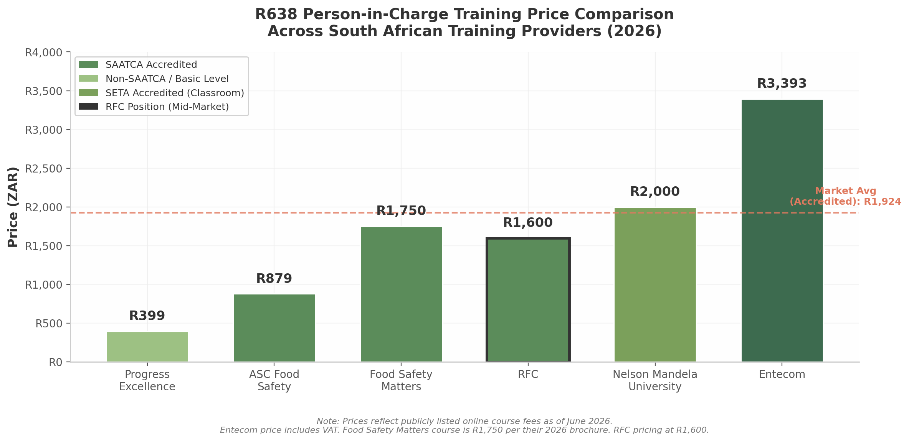
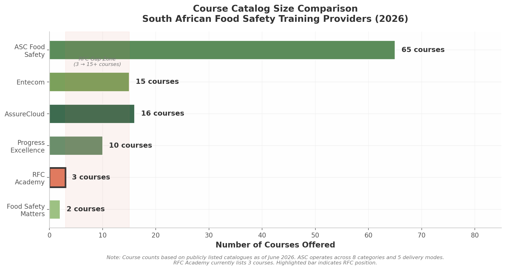

## 2. Competitive Landscape Analysis

RFC operates in a moderately competitive but fragmented market for food safety consulting and training in South Africa. Thirteen significant competitors were identified across three tiers: four full-service direct competitors that mirror RFC's consulting-plus-training model, four training-focused specialists that compete primarily for academy revenue, and five international certification bodies that exert pressure at the enterprise end of the market. The most important strategic insight from this analysis is that the competitive battlefield has shifted from credentials — where most SAATCA-registered providers are broadly equivalent — to content marketing, course catalog breadth, and digital lead generation. ASC Food Safety and Entecom have established commanding leads in these areas that RFC is currently not contesting. The sections below map each competitor's positioning, catalogue strength, pricing strategy, and content engine so that RFC can identify precisely where to attack, where to defend, and where to differentiate.

---

### 2.1 Tier 1: Direct Competitors

Direct competitors are organisations offering both food safety consulting and accredited training in South Africa, operating under SAATCA or equivalent accreditation, and targeting the same mid-market manufacturing and processing clients that RFC serves.

#### 2.1.1 ASC Food Safety: The Two-Site Juggernaut

ASC Food Safety Consultants (ascfoodsafety.com) is RFC's most formidable competitor across virtually every metric that matters for digital visibility and training revenue. Headed by Mthokozisi Nkosi — one of only three SAATCA Registered R638:2018 Lead Implementers in South Africa — ASC has built a content moat unmatched by any other domestic competitor [^141^]. The organisation operates a deliberate two-site strategy: ascfoodsafety.com handles consulting and SEO-driven content, while ascfoodsafetytraining.com functions as a dedicated learning management system, effectively doubling ASC's SERP real estate for every high-value keyword [^3^].

ASC offers 65-plus courses across eight categories and five delivery modes — online self-paced, virtual classroom, physical classroom, enterprise on-site, and blended [^3^]. Its R638 Person-in-Charge course, the market's highest-volume training product, is priced at R879, making it the most aggressively priced SAATCA-accredited online offering and significantly undercutting RFC's R1,600 price point [^141^]. ASC supplements this with triple accreditation — SAATCA Technical Certificate No. 065, FoodBev SETA accreditation (F01/585/ASR00067), and HPCSA recognition — enabling municipal acceptance across all 278 South African municipalities and unlocking Skills Development Levy claims for corporate clients [^141^].

Where ASC truly separates itself is content marketing. The company maintains a blog with pillar pages regularly exceeding 2,000 to 5,000 words, covering topics from FSSC 22000 V7 transition to BRCGS Issue 9 audit preparation [^160^]. Each article features FAQ sections, related-article cross-linking, and embedded CTAs driving readers toward course enrolment or consulting enquiries. The organisation also produces downloadable FSMS toolkits, self-inspection checklists, and cleaning schedule templates that function as both lead magnets and productised revenue streams [^3^]. ASC has positioned itself as the default information source for food safety decision-makers in South Africa; any prospect researching R638 compliance, HACCP certification, or FSSC 22000 implementation is likely to encounter ASC's content before finding RFC. Closing this content gap is not optional — it is prerequisite to competing for the same client base.

#### 2.1.2 Entecom: The Content Factory with a Software Moat

Entecom (entecom.co.za), operating for 19 years from its Gqeberha headquarters with a franchise network extending nationwide and into Botswana, adds two differentiated revenue streams that RFC cannot currently match: EO Food Compliance Software and the Small Supplier Compliance Programme [^135^]. EO is Entecom's proprietary SaaS compliance platform that digitises checklists, document control, supplier quality assurance, and internal auditing. Client testimonials from FSMS lead auditors describe the system as "the first one that makes a lot of sense" among document management tools encountered during audits [^136^]. EO generates recurring subscription revenue that insulates Entecom from the project-based consulting cycle. The Small Supplier Compliance Programme offers tiered packages from basic R638 compliance through GFSI Intermediate Level certification, targeting the same SME segment that RFC serves but at lower price points and with greater scalability [^135^].

Entecom's content engine rivals ASC's in format diversity. The Guidance Hub contains 46-plus articles, 61-plus downloadable eBooks, 11-plus podcasts, and 5-plus webinars [^131^]. New content is published regularly — the latest article was dated April 2026 — which signals active indexing by search engines and sustained audience engagement [^76^]. Lead generation tactics include free eBook downloads gated behind email capture, chat widgets on every page, callback request forms, and a course shop with full cart functionality [^77^]. For RFC, Entecom represents the benchmark for content volume and format diversity. The 61-plus eBooks alone constitute a library that RFC currently has no parallel to, and the podcast presence creates brand authority in a format that no other Tier 1 competitor has embraced at scale [^76^].

#### 2.1.3 Shilux: The Cape Town Challenger with Digital Tools

Shilux (shilux.co.za), headquartered in Century City, Cape Town, presents a differentiated value proposition built around QMSure — a paperless quality management system competing directly with Entecom's EO platform — and an SME Supplier Compliance Support Programme with WhatsApp integration [^105^]. The WhatsApp click-to-functionality recognises the communication preferences of South African business owners and provides step-by-step guided compliance for small suppliers [^106^]. Shilux's content strategy is comparatively modest — a resources section, FAQ page, and dedicated landing pages — and the organisation does not appear to invest heavily in long-form SEO content, which creates a potential opening for RFC in the organic search channel [^105^]. However, its standards coverage is broad, spanning BRCGS Food Safety Issue 9, GLOBALG.A.P. IFA Version 6, IFS Food Version 8, and ISO/IEC 17025:2017, positioning it as a credible alternative for clients with multi-standard certification needs [^134^].

#### 2.1.4 Your Food Safety Guide / Figuro: Productised Consulting for Food Founders

Your Food Safety Guide (yourfoodsafetyguide.co.za), the public-facing brand of Bennii Van Rooy Consulting (BVRC), represents a fundamentally different competitive threat. Rather than competing on consulting hours or training days, Figuro sells self-service digital tools that enable food founders to build their own audit-ready food safety systems without ongoing consultant engagement [^107^]. The product suite includes Figuro HACCP (a guided HACCP plan builder), Figuro PRP (prerequisite programme documentation), and Figuro Founder (food safety culture training), all sold as one-time purchases [^93^]. Figuro-Learn adds online training courses aligned with SANS 10330 and SANS 10049, competing directly with RFC's academy offerings [^107^].

The content strategy is tightly aligned with the product funnel. Blog articles are written in plain language — deliberately anti-jargon — targeting South African food founders with topics such as HACCP plan templates and food safety certification requirements for small businesses [^93^]. A free newsletter captures email addresses, and a "Find Your Starting Point" quiz directs prospects toward the appropriate Figuro product [^107^]. BVRC has supported over 300 audits across 25 years and has built a brand that resonates specifically with small food businesses and startups — a segment RFC cannot afford to lose to digital alternatives that transfer knowledge rather than retaining dependency [^132^].

---

### 2.2 Tier 2: Training-Focused Competitors

Tier 2 competitors derive primary revenue from training delivery, often through a single platform or modality, with consulting offered as a secondary or non-existent service. They pose less threat to RFC's consulting revenue but compete directly for the same training enrolments that RFC Academy targets.

#### 2.2.1 Progress Excellence: The Price Disruptor

Progress Excellence (progress-excellence.co.za) operates from the Western Cape and has positioned itself as the lowest-cost provider in the online food safety training market. Its basic food safety course at R399 — the cheapest online offering identified, though not SAATCA-accredited at this tier — captures price-sensitive learners who may not understand the distinction between accredited and non-accredited credentials [^73^] [^74^]. The organisation maintains an "Information Hub" and "Food Bites Blog" with approximately 20-plus articles covering food safety, quality, health and safety, and environmental management topics, supplemented by downloadable resources including ISO 22000 version comparisons and GFSI standard comparisons that serve as soft lead magnets [^161^]. The strategic risk for RFC is not that Progress Excellence will steal high-value consulting clients — its positioning is too commoditised — but that it anchors price expectations at the low end of the market, creating an objection that RFC's sales process must be equipped to overcome.

#### 2.2.2 Food Safety Matters: The Entrepreneur-Focused Niche Player

Food Safety Matters (foodsafetymatters.co.za) delivers courses through the Thinkific platform and has carved out a sharply defined niche: entrepreneurs and new food businesses navigating their first COA application and R638 compliance requirements [^33^]. Its R638 Person-in-Charge course is SAATCA-accredited (TCP No. 045) and priced at R1,750, slightly above RFC's R1,600 [^138^]. The content strategy is laser-focused on the entrepreneur journey, with articles such as "Everything You Need to Know When Starting a Food Business in South Africa" and "How to Get Your Certificate of Acceptability in 5 Steps" [^75^]. Two free downloadable resources — the full Regulation 638 PDF and a COA application process guide — function as lead magnets that build trust before any purchase decision [^33^]. Food Safety Matters is RFC's closest competitor in terms of target audience overlap, and its Thinkific-based delivery model provides a smooth learner experience that RFC should benchmark [^28^].

#### 2.2.3 AssureCloud: The Certification Body with Training

AssureCloud (assurecloud.co.za), the training arm of Aspirata, operates for over 20 years with JAS-ANZ and SANAS accreditation and B-BBEE Level 1 status [^81^]. Unlike RFC, AssureCloud's primary business is certification auditing — issuing ISO 22000, FSSC 22000, and HACCP certificates — with training delivered as a supporting service to build the pipeline of certification-ready clients [^50^]. Its 16-plus course catalogue spans specialised programmes that RFC does not currently match, including Micro for Non-Microbiologists, Food Defence and Food Fraud (VACCP/TACCP/HACCP), and Pest Control [^50^]. AssureCloud's content presence is thin, creating a gap that RFC could exploit. However, its dual role as both certifier and trainer creates a conflict-of-interest barrier that RFC, as a non-certifying consultancy, can leverage: clients wanting implementation support from an organisation that will not also audit them may prefer RFC's independence.

#### 2.2.4 Hygiene Heroes: The Community-Movement Approach

Hygiene Heroes (hygieneheroes.org.za) positions itself not as a conventional training provider but as a movement for food service businesses. Its primary asset is a comprehensive free guide — "A Step-by-Step Guide to R638, HACCP, and Hygiene Best Practices" — covering South African food safety law, R638 breakdown, the five food safety rules, and the seven HACCP principles [^25^]. This is one of the most thorough free R638 resources available in South Africa and likely captures significant organic search traffic for informational queries that RFC's website is currently not configured to intercept. Hygiene Heroes does not appear to offer SAATCA-accredited training, which limits its threat to RFC's high-value course revenue, but its community positioning builds brand loyalty that can translate into paid service recommendations over time.

---

### 2.3 Tier 3: International Certification Bodies

Tier 3 competitors are large international organisations whose South African operations represent a small component of global food safety certification and training revenue. They do not compete aggressively for RFC's mid-market consulting clients but set the ceiling for accreditation credibility and influence enterprise procurement decisions.

Mérieux NutriSciences EQUIP (za-equip.mxns.com) operates for 29-plus years with 9,000-plus graduates and 250-plus company clients [^83^]. Its strength lies in laboratory and technical training — microbiological testing, analytical methods, and laboratory quality management — areas where RFC does not currently compete. EQUIP's SEO presence for consulting keywords is minimal, and its catalogue does not overlap significantly with RFC's target market of food premises managers and HACCP implementers [^83^].

SGS South Africa (sgs.com/en-za) is a GLOBALG.A.P. approved certification body and FSSC 22000 certification services provider offering CQI and IRCA-accredited lead auditor training at premium international rates targeting large organisations [^112^] [^115^]. The SABS Training Academy (sabs.co.za), the training division of South Africa's national standards body, carries unmatched institutional credibility as SAATCA-approved online provider No. 003 but maintains a limited digital presence and traditional classroom-based delivery model that creates a service gap more digitally agile providers can exploit [^151^] [^155^]. DQS Academy (dqsglobal.com/en/learn) and TÜV SÜD (tuvsud.com/en-za) both deliver FSSC 22000 auditor training at premium pricing, competing for auditor certification — a segment RFC does not currently target [^116^] [^113^]. Neither invests meaningfully in R638 training, HACCP implementation consulting, or SME-focused content, leaving the mid-market segment that RFC dominates relatively uncontested by these international players.

The collective lesson from Tier 3 is that the most competitive layer of the South African food safety market is not at the top, where international brands serve large enterprises, but at the mid-market and SME levels where RFC, ASC, Entecom, and Shilux compete for the same consulting engagements and training enrolments. RFC's strategic priority should be to defend and expand this mid-market position rather than chase enterprise clients that international certification bodies are better resourced to serve.

---

### 2.4 Pricing and Course Catalog Comparison

#### Table 2.1: R638 Person-in-Charge Training Price Comparison

| Provider | Price (ZAR) | Format | Accreditation | Duration | Key Differentiator |
|----------|-------------|--------|---------------|----------|-------------------|
| Progress Excellence | R399 | Online self-paced | Not SAATCA (basic level) | Not specified | Lowest price; entry-level positioning [^73^] |
| ASC Food Safety | R879 | Online self-paced | SAATCA + FoodBev SETA + HPCSA | 17 hours, 4 modules | Most aggressively priced triple-accredited course [^141^] |
| Food Safety Matters | R1,750 | Online via Thinkific | SAATCA (TCP 045) | 6–7 hours | Thinkific platform; entrepreneur-focused content [^138^] |
| **RFC** | **R1,600** | **Online** | **SAATCA** | **Not specified** | **Mid-market positioning** [^2^] |
| Nelson Mandela University | R2,000 | 2-day classroom | SETA Accredited | 2 days | Academic credibility; classroom delivery [^51^] |
| Entecom | R3,393 (incl VAT) | Online video eLearning | SAATCA / SETA | 16–20 hours | Most comprehensive; video-based with assessor support [^87^] |

The pricing data reveal a bifurcated market. At the low end, Progress Excellence's R399 basic course and ASC's R879 triple-accredited offering compete on price accessibility, anchoring consumer expectations below R1,000 for online R638 training. At the premium end, Entecom's R3,393 course justifies its price through 16–20 hours of video content, three modules with formative assessments, and simulated video-based workplace evaluation [^87^]. Nelson Mandela University's R2,000 classroom offering occupies a distinct segment for learners preferring academic institutional credentials [^51^]. RFC's R1,600 positioning sits in a contested middle zone — more expensive than ASC's likely loss-leader pricing but cheaper than Entecom's premium package. The mid-market positioning is defensible only if RFC can demonstrate superior value through personalised support, deeper consulting integration, local Pretoria presence, or bundled services that ASC does not offer at entry level.

*Figure 2.1: R638 Person-in-Charge training prices across six South African providers. RFC's R1,600 positioning sits just below the R1,924 market average for accredited courses (red dashed line). Source: competitor website analysis, June 2026.*

#### Table 2.2: Course Catalog Size and Category Comparison

| Provider | Courses Offered | Categories | Delivery Modes | Geographic Focus |
|----------|-----------------|------------|----------------|------------------|
| ASC Food Safety | 65+ | 8 categories, 5 levels | Online, virtual, classroom, on-site, blended | National (Gqeberha, Randburg, Cape Town) [^3^] |
| AssureCloud | 16+ | Auditing, HACCP, ISO, R638, PRPs, culture | Classroom, on-site | National [^50^] |
| Entecom | 15+ | Food safety, health & safety, ISO, environmental | eLearning, virtual, classroom, workshops | National (franchise network) [^76^] |
| Progress Excellence | 10+ | Food safety, quality, HSE, auditing | Online, classroom | Western Cape [^73^] |
| **RFC Academy** | **3** | **Food safety only** | **Online** | **Pretoria / National** [^2^] |
| Food Safety Matters | 2 | R638, basic food handler | Online via Thinkific | National [^33^] |

The catalog comparison exposes RFC Academy's most critical competitive vulnerability: with only three courses, RFC ties with Food Safety Matters as the smallest catalogue among all analysed competitors [^2^]. ASC's 65-plus courses represent a 22-fold advantage in product breadth, but even AssureCloud (16-plus) and Entecom (15-plus) offer five times the training options of RFC Academy [^50^] [^76^].

*Figure 2.2: Course catalog size comparison across six food safety training providers. RFC Academy's 3 courses represent the second-smallest catalogue, creating a significant competitive gap in training revenue potential. Source: competitor website analysis, June 2026.*

#### Table 2.3: Content Strategy and Lead Generation Capability Comparison

| Provider | Blog/Articles | Downloadable Resources | Lead Capture Mechanisms | Content Freshness | SEO Strength |
|----------|---------------|----------------------|------------------------|-------------------|--------------|
| ASC Food Safety | 50+ pillar guides (2,000–5,000 words) | FSMS toolkits, checklists, templates | Free consultation, course bundles, WhatsApp, enterprise enquiry | Weekly updates [^160^] | Very High — page 1 for virtually all major keywords [^3^] |
| Entecom | 46+ articles, 61+ eBooks, 11 podcasts, 5 webinars | eBooks (gated), webinar recordings | Free downloads, chat widget, callback requests, newsletter, franchise enquiry | Monthly updates [^131^] | High — multi-format indexing [^76^] |
| Shilux | Resources section, FAQ | SME support guide | WhatsApp click-to-chat, contact form, software demo requests | Infrequent [^105^] | Moderate — thin long-form content |
| Figuro / Your Food Safety Guide | Blog with founder-focused articles | Free newsletter, quiz tool, micro-lessons | Newsletter signup, "Find Your Starting Point" quiz, portal access | Weekly newsletter [^107^] | Moderate — focused niche |
| Progress Excellence | 20+ articles (Food Bites Blog) | PDF comparisons, fact sheets | Newsletter signup (header), custom quote requests | Infrequent [^161^] | Low-Moderate |
| Food Safety Matters | 5+ SEO-targeted blog posts | Free R638 PDF, free COA guide | Free download gating for email capture | Infrequent [^33^] | Moderate — strong niche focus |
| Hygiene Heroes | 1 comprehensive guide | Free R638 compliance guide | "Join the Movement" community signup | Unknown [^25^] | Low — single asset |
| **RFC** | **None** | **None** | **Contact form only** | **N/A** [^2^] | **Very Low — no content index** |

#### Strategic Analysis and Recommendations

The pricing and catalog data converge on a single diagnosis: RFC is under-invested in the two assets that increasingly determine competitive success — training course breadth and content marketing infrastructure.

**Recommendation 1: Close the course catalog gap through phased expansion.** RFC Academy should add four to six courses within the next 12 months, prioritising topics that RFC already teaches in consulting engagements, that carry proven search demand, and that do not require new accreditation. Priority additions include: HACCP Awareness and Implementation, Internal Auditor Training (ISO 22000 / FSSC 22000), Food Defence and Food Fraud (VACCP/TACCP), Food Safety Culture, and Basic Food Handler Training. Each is offered by at least two competitors, confirming market demand, and RFC's existing SAATCA registration likely covers or can be extended to these programme areas.

**Recommendation 2: Defend the R1,600 price point through value bundling.** ASC's R879 pricing is almost certainly a loss-leader designed to maximise enrolment volume. RFC cannot profitably match this price. Instead, RFC should bundle its R638 course with high-value add-ons that ASC does not include at entry level: a downloadable R638 compliance checklist, a COA application guide, a 15-minute post-course consultation call, and WhatsApp support for regulatory questions. This transforms the offering from "a course" to "a compliance package," justifying the premium over ASC's stripped-down entry product.

**Recommendation 3: Launch a content hub before expanding the catalog.** While course expansion addresses revenue potential, content marketing addresses customer acquisition cost. ASC and Entecom have built moats of indexed content that attract organic traffic without ongoing advertising spend. RFC currently has no blog, no resources section, and no lead magnets — meaning every prospect must be acquired through paid channels or personal referral [^2^]. Launching a /blog or /resources section on rfcsa.co.za with four pillar articles ("Complete Guide to R638 Compliance," "HACCP Training in South Africa: 2026 Comparison," "FSSC 22000 V7: What Changed," and "How to Get Your Certificate of Acceptability in Pretoria") would begin closing the content gap within 60 days and create indexed assets that generate traffic for years.

**Recommendation 4: Target the local SEO gap while national competitors focus elsewhere.** ASC's city landing pages focus heavily on Gqeberha and the Eastern Cape, with secondary coverage of Johannesburg and Cape Town [^3^]. Pretoria — RFC's home market — receives comparatively thin competitive coverage. Creating dedicated landing pages for "food safety training Pretoria," "R638 training Pretoria," and "HACCP training Pretoria" with locally relevant content — Tshwane municipal COA application procedures, local inspector contact information, Pretoria-specific case studies — would give RFC first-mover advantage in local search results for its own geographic backyard. This is the single highest-opportunity, lowest-competition SEO play available to RFC.

**Recommendation 5: Implement lead generation infrastructure that matches Tier 1 standards.** ASC offers free consultations, course bundles, enterprise enquiry forms, and WhatsApp contact options. Entecom provides 61-plus gated eBooks, chat widgets, callback requests, and newsletter signups. RFC currently offers a contact form only [^2^]. The minimum viable upgrade is to add three mechanisms within 30 days: a free downloadable R638 compliance checklist (PDF, gated behind email capture), a WhatsApp Business click-to-chat button on every page, and a newsletter signup with a monthly regulatory update. These three additions would bring RFC's lead capture capability from non-existent to competitive without requiring custom development or significant content creation.
