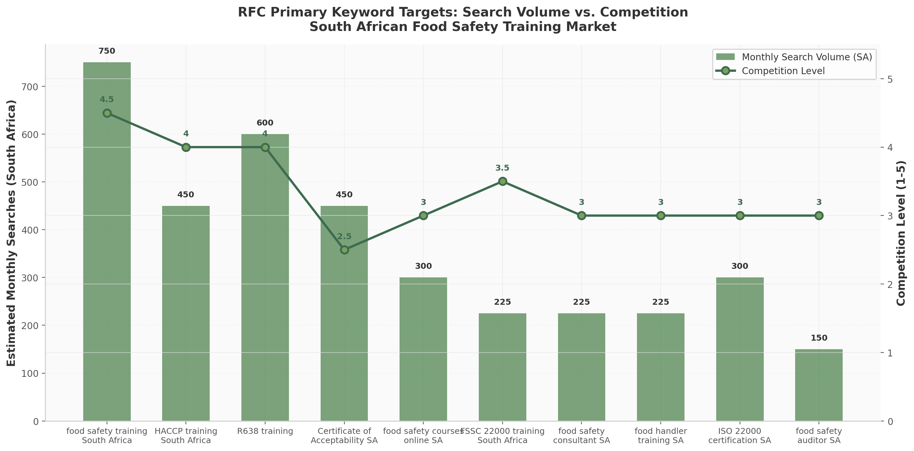

## 3. SEO Strategy & Recommendations

The competitive analysis conducted in Chapter 2 reveals a fragmented but rapidly maturing digital landscape for food safety training and consulting in South Africa. While ASC Food Safety Consultants has established commanding visibility through a two-site strategy and extensive content marketing, and Entecom leverages a multi-format guidance hub with 61+ downloadable eBooks, RFC's current digital footprint remains substantially underdeveloped [^3^] [^76^]. Neither rfcsa.co.za nor rfcacademy.co.za currently maintains a visible blog, city-specific landing pages, or structured schema markup — omissions that directly suppress organic discoverability at the precise moment when South African food businesses are increasingly searching for compliance solutions online.

This chapter translates the competitor intelligence and keyword research into a comprehensive, prioritised SEO strategy organised around four pillars: keyword targeting that matches genuine search behaviour, on-page and technical improvements that satisfy both user intent and search engine crawling requirements, local SEO that captures geographically constrained commercial intent, and link building that builds domain authority through credible industry associations. Every recommendation is benchmarked against verified competitor activity and prioritised by expected commercial impact.

### 3.1 Keyword Strategy

Effective keyword strategy for RFC must operate on three simultaneous levels: capturing high-volume commercial terms where the greatest raw traffic exists, securing long-tail queries where conversion intent is sharpest and competition thinnest, and dominating the local geographic modifiers that connect RFC's Pretoria-based operations to businesses across Gauteng. The following subsections address each layer in turn.

#### 3.1.1 High-Volume Primary Targets

The South African food safety training market generates concentrated search volume around a cluster of ten commercially valuable keywords. These terms collectively represent an estimated 3,275 to 5,450 monthly searches and should form the foundational targeting layer for RFC's homepage, core service pages, and primary landing pages.

| Keyword | Monthly Searches (SA) | Competition | Search Intent | Priority |
|:---|:---|:---|:---|:---|
| food safety training South Africa | 500–1,000 | High | Commercial | Critical |
| R638 training | 400–800 | High | Commercial | Critical |
| HACCP training South Africa | 300–600 | High | Commercial | Critical |
| Certificate of Acceptability South Africa | 300–600 | Low-Medium | Informational/Commercial | Critical |
| food safety courses online South Africa | 200–400 | Medium | Commercial | High |
| ISO 22000 certification South Africa | 200–400 | Medium | Commercial | Medium |
| FSSC 22000 training South Africa | 150–300 | Medium-High | Commercial | High |
| food safety consultant South Africa | 150–300 | Medium | Commercial | High |
| food handler training South Africa | 150–300 | Medium | Commercial | High |
| food safety auditor South Africa | 100–200 | Medium | Commercial | Medium |

The concentration of search volume around R638-related terms demands particular attention. Regulation R638 of 2018 governs general hygiene requirements for all food premises and the transport of food in South Africa, applying universally from restaurants and spaza shops to large manufacturers [^25^]. RFC already offers SAATCA-accredited R638 training at R1,600, yet the academy page is not optimised for the primary "R638 training" keyword, leaving an estimated 400–800 monthly searches captured almost entirely by ASC (pricing aggressively at R879), Food Safety Matters (blog-optimised with free regulation downloads), and Entecom (premium at R3,393) [^3^] [^33^] [^76^].

The "Certificate of Acceptability" keyword cluster presents a different competitive dynamic. Despite generating 300–600 monthly searches, this topic faces lower competition because most established competitors target certified food safety professionals rather than entrepreneurs starting new food businesses [^33^] [^75^]. Food Safety Matters has made this niche their primary content focus, publishing articles such as "How to Get your Certificate of Acceptability (COA) in 5 Steps" [^33^]. RFC can capture significant share here by creating authoritative COA content that bridges informational intent with a soft conversion path toward R638 training enrollment. The divergence between high-volume, high-competition head terms like "food safety training South Africa" and the moderate-competition COA cluster suggests a dual-track approach: pursue the most contested terms through core service pages while building topical authority in lower-competition informational clusters through dedicated blog content.

#### 3.1.2 Long-Tail Opportunities with Lower Competition

Long-tail keywords — queries comprising three or more words with narrower specificity — consistently deliver higher conversion rates than broad head terms because they capture searchers with defined intent. The South African food safety long-tail landscape is remarkably fertile, with many commercially valuable terms showing very low or low competition and no competitor having comprehensively mapped this terrain.

The FSSC 22000 V7 transition keyword represents the most time-sensitive long-tail opportunity. Foundation FSSC published Version 7 in May 2026, with upgrade audits commencing 1 May 2027 and all certified organisations required to transition within a 12-month window ending 30 April 2028 [^118^] [^122^]. Despite this regulatory deadline, few South African competitors have created dedicated V7 content. ASC's V7 guide — comprehensive at over 5,000 words — is one of the few authoritative resources [^117^]. RFC's existing FSSC 22000 expertise positions it to capture the "FSSC 22000 V7 transition South Africa" query and its variants (50–100 monthly searches, very low competition) by publishing the first locally focused V7 transition guide.

The "R638 compliance checklist PDF" keyword carries dual intent: the searcher requires a practical compliance tool (informational) but is actively managing food safety compliance (commercial). No competitor currently offers a comprehensive, downloadable R638 checklist as a lead magnet — Food Safety Matters provides the regulation text itself rather than a structured compliance tool [^33^]. An RFC-branded checklist gated behind email capture could capture 100–200 monthly searches while building a qualified lead database. Other high-priority long-tail targets include "how to apply for COA South Africa" (50–100 searches, low competition), "food safety training Pretoria" (50–100, low), "food safety training Johannesburg" (50–100, low), "what is Regulation 638" (100–200, low), and emerging specialisation terms such as "food defence plan training South Africa" and "food fraud mitigation training" (20–40 searches each, very low competition).

#### 3.1.3 Local SEO Keywords for Pretoria, Johannesburg, and Gauteng

Geographic keyword modifiers transform generic service queries into high-intent local commercial searches. RFC's local keyword strategy spans three geographic tiers: Pretoria and Johannesburg individually (Tier 1), Gauteng province-level searches (Tier 2), and secondary cities where RFC could deliver virtual or on-site services — Cape Town, Durban, Bloemfontein, and Polokwane (Tier 3).

Local keyword competition is notably lower than national-level equivalents. "Food safety training Pretoria" and "food safety training Johannesburg" each generate 50–100 monthly searches but face low competition, primarily because ASC concentrates its local SEO on Gqeberha and Cape Town [^3^]. This geographic gap creates a first-mover opportunity: RFC can establish dominant local rankings for Pretoria and Johannesburg before ASC or Entecom redirect SEO resources toward Gauteng. City-specific landing pages should be created with genuinely unique content — not templated duplicates — referencing local municipal requirements (such as City of Tshwane Environmental Health Department procedures), nearby landmarks, and Gauteng-specific case studies [^89^].

#### 3.1.4 Question-Based Keywords from "People Also Ask"

Google's "People Also Ask" feature generates question-based rich snippets that occupy prominent search results page real estate. Targeting these question keywords captures featured snippet positions that build brand authority and funnels informationally motivated searchers toward RFC's commercial offerings.

Fifteen high-priority question-based queries have been identified: "What is Regulation R638 in South Africa?"; "How do I apply for a Certificate of Acceptability?"; "What training is required for food handlers in South Africa?"; "How much does HACCP training cost in South Africa?"; "What is the difference between HACCP and FSSC 22000?"; "Who needs R638 training?"; "How long does ISO 22000 certification take?"; "What is a food safety auditor?"; "How do I start a food business in South Africa?"; "What are the 7 principles of HACCP?"; "What is food safety culture?"; "What is food defence and food fraud?"; "What is GLOBALG.A.P certification?"; "How often should food safety training be done?"; and "What are the requirements for a food premises in South Africa?". These questions map to distinct content formats: pricing comparisons require comprehensive guides, definitional queries suit FAQ schema markup for rich snippets, and comparison questions ("HACCP vs FSSC 22000") demand structured tables that position RFC's training portfolio regardless of which standard the reader ultimately needs. ASC has already captured several through 3,000–5,000 word guides with dedicated FAQ sections [^3^]; RFC can differentiate by incorporating local Pretoria and Gauteng context.

#### 3.1.5 Content Cluster Strategy

A content cluster architecture organises related articles around authoritative pillar pages, signalling topical depth to search engines and creating internal linking pathways that distribute link equity. Based on the keyword research, RFC should build five pillar content clusters, each anchored by a comprehensive guide page and supported by four to six cluster articles targeting specific long-tail keywords.

Pillar 1 addresses R638 and Certificate of Acceptability compliance — the highest-traffic opportunity. The pillar page "The Complete Guide to Regulation R638 Compliance in South Africa" would be supported by cluster articles on COA applications by city, R638 training requirements for persons in charge, a downloadable compliance checklist, and how to prepare for municipal health inspections. This pillar alone could capture an estimated 800–1,400 monthly searches. Pillar 2 centres on HACCP training, Pillar 3 on FSSC 22000 and ISO 22000 certification (with the FSSC 22000 V7 transition guide serving as anchor content during the 2026–2028 transition window [^118^]), Pillar 4 on audience-specific food safety requirements for restaurants, spaza shops, school kitchens and catering businesses, and Pillar 5 on emerging specialisations including food defence, food fraud, VACCP, TACCP, and food safety culture.

Implemented over six months with two to four articles published monthly, this architecture would generate 40–50 new indexed pages. For context, ASC's articles section with in-depth guides and learning pathways enables page-one rankings for virtually every major food safety training keyword in South Africa [^3^], while Entecom's 46+ articles and 61+ eBooks drive consistent organic traffic through regular indexing opportunities [^76^]. RFC's absence of any blog or resources section represents the single largest gap in its current SEO profile.

### 3.2 On-Page SEO Improvements

On-page SEO encompasses every directly controllable element that can improve search visibility and user experience. The analysis of RFC's websites against competitor best practices reveals multiple deficiencies that suppress rankings regardless of content quality.

| Priority | Action Item | Implementation Detail | Expected Impact |
|:---|:---|:---|:---|
| Critical | Launch blog/content hub | Create /blog or /resources on rfcsa.co.za; publish 2–4 articles/month targeting cluster keywords | Highest — addresses single largest gap vs. competitors |
| Critical | Create city landing pages | Build pages for Pretoria, Johannesburg, Cape Town, Durban, Bloemfontein with unique local content | High — captures local commercial intent in under-served markets |
| High | Optimise page titles | Format: "[Service] \| [City] \| RFC" — e.g., "HACCP Training Pretoria \| SAATCA Accredited \| RFC" | High — improves click-through rates and ranking relevance |
| High | Implement FAQ schema markup | Add FAQPage structured data to all service pages; target rich snippet display | Medium-High — increases SERP visibility |
| High | Write meta descriptions | Compelling 155-character descriptions with CTAs for all indexed pages | Medium — improves CTR from SERPs |
| High | Build internal linking structure | Cross-link service pages to related academy courses and resources | Medium — distributes link equity |
| High | Fix heading hierarchy | Ensure proper H1/H2/H3 structure with keyword inclusion on every page | Medium — improves crawlability |
| Medium | Add descriptive alt text | Keyword-inclusive alt text for all images across both domains | Low-Medium — image search visibility |
| Medium | Create service silos | Group content under /training/, /consulting/, /auditing/, /resources/ paths | Medium — improves site architecture |
| Medium | Add breadcrumb navigation | Schema-compatible breadcrumbs for all pages | Low-Medium — improves UX |

The creation of a blog or content hub is the most consequential on-page action. ASC's ascfoodsafety.com maintains an articles section with in-depth guides averaging 2,000–5,000 words, related article cross-linking, and content organised in learning pathways from basic food handler to advanced FSSC 22000 certification [^3^]. Entecom's guidance hub publishes across 46+ articles, 61+ eBooks, 11+ podcasts, and 5+ webinars, with the latest updates appearing as recently as April 2026 [^76^]. RFC's complete absence of blog content means it cannot participate in the informational keyword ecosystem, cannot earn featured snippets, and misses the repeated indexing opportunities that fresh content triggers. The blog should launch with four pillar articles (one each for Pillars 1–4 from Section 3.1.5) at 2,000+ words each, with two to four articles published monthly thereafter.

City landing pages address the second most significant gap. RFC currently lacks geographically specific service pages, meaning it cannot rank for the 50–100 monthly searches each for "food safety training Pretoria" or "food safety training Johannesburg" [^121^]. Each page must contain genuinely unique content — not templates with swapped city names — referencing local municipal health department contacts, specific suburbs where RFC has served clients, testimonials from local businesses, and an embedded Google Map. Title tag optimisation delivers immediate impact with minimal effort: the recommended format "[Primary Service] \| [City] \| [Brand]" aligns with ASC's location-aware titles [^3^]. FAQ schema markup is similarly high-impact and low-effort, with rich snippets increasing click-through rates by 15–30%.

#### 3.2.1 Technical SEO Priorities

Technical SEO ensures search engines can efficiently crawl, index, and render RFC's content. Mobile optimisation is the most urgent requirement: the current rfcsa.co.za site is not fully responsive, a critical deficiency given that 88% of mobile local business searches in South Africa result in a call or visit within 24 hours [^126^] and Google operates mobile-first indexing. A responsive rebuild is essential. Site speed improvement should target sub-three-second load times through image compression to WebP format (30–50% reduction), CSS and JavaScript minification (20–30%), Cloudflare CDN implementation, and lazy loading for below-fold images. Additional critical actions include ensuring HTTPS across both domains, creating and submitting XML sitemaps for both rfcsa.co.za and rfcacademy.co.za, optimising robots.txt for full crawlability, implementing canonical tags to prevent duplicate content between domains, and cleaning URL structures to keyword-rich formats such as /haccp-training-pretoria/ rather than /page-id=123.

### 3.3 Local SEO Strategy

Local SEO determines whether RFC appears when businesses in Pretoria, Johannesburg, or broader Gauteng search for food safety services with geographic intent. With 46% of all Google searches classified as local and 97% of consumers learning about local businesses online, local optimisation is a core revenue driver, not a supplementary activity [^121^].

#### 3.3.1 Google Business Profile Optimisation

Google Business Profile (GBP) is the most influential single factor for local search visibility. Businesses with a complete GBP are 2.7 times more likely to be viewed as reputable and 70% more likely to attract physical visits [^124^]. RFC must claim or create its listing with the exact business name "Retha Faul Food Safety Consultants," set primary categories as "Food Safety Consultant" and "Training Centre," and craft a description incorporating target keywords naturally: "SAATCA-accredited food safety training and consulting in Pretoria, Gauteng. Specialising in R638 compliance, HACCP certification, FSSC 22000, and food safety audits for South African food businesses." All services should be listed as individual items, with weekly GBP posts announcing course dates, sharing blog links, and highlighting client success stories. High-quality photographs of training facilities, team members, and certification credentials should be uploaded monthly to signal active operations to Google's local algorithm.

#### 3.3.2 NAP Consistency and Local Citation Building

Name, Address, and Phone number (NAP) consistency across the web is a foundational local ranking signal. RFC's business name, physical Pretoria address, and contact number must appear identically on every directory listing and social profile — even minor variations dilute citation authority and confuse Google's entity recognition.

| Directory | Type | Priority | Notes |
|:---|:---|:---|:---|
| Yello (yello.co.za) | General SA business directory | High | Strong domain authority, free listing |
| Brabys (brabys.com) | General SA business directory | High | Well-established local search presence |
| Hotfrog (hotfrog.co.za) | General business directory | High | Free listing, good for NAP consistency |
| SA Yellow (sayellow.com) | General SA directory | High | Established local index |
| Business Directory (businessdirectory.co.za) | General business directory | High | Free and paid options |
| Find It SA (finditSA.co.za) | General SA directory | Medium | Growing local business index |
| SABizGuide (sabizguide.co.za) | General business directory | Medium | B2B-focused |
| Yalwa (yalwa.co.za) | General classifieds/directory | Medium | International platform with SA presence |
| Cylex (cylex.co.za) | Business directory | Medium | Strong European/SA presence |
| Snupit (snupit.co.za) | Service marketplace | Medium | Quote-request platform |
| SAATCA Directory (saatca.co.za) | Industry accreditation body | Critical | Professional registration, high authority |
| FoodBev SETA Provider List | SETA accreditation body | Critical | Official training provider listing |
| SAAFFI Supplier Directory | Food industry association | High | Food and allied industries index |
| Food & Beverage Reporter Directory | Trade publication | High | Industry-specific visibility [^99^] |
| SIZA Member Directory | Sustainability organisation | Medium | Food chain compliance relevance |

General directories build citation volume and NAP consistency, while industry-specific listings carry substantially higher trust signals because they represent verified professional registrations. The SAATCA directory is particularly valuable: as South Africa's official body for certifying management system auditors, a profile on saatca.co.za confers immediate professional credibility and delivers a high-authority backlink [^3^]. Inclusion on the FoodBev SETA provider list validates RFC's training accreditation and connects the business to the Sector Education and Training Authority's referral channels. Citation building should be staged across three months — general directories in month one (five listings per week), industry-specific directories in month two, and ongoing monitoring in month three — with unique 150–250 word business descriptions for each listing to avoid duplicate content penalties.

#### 3.3.3 Customer Review Generation Strategy

Google reviews are the strongest local ranking factor after GBP optimisation and the most influential conversion signal for B2B services. RFC should implement systematic review collection at three touchpoints: immediately following training completion, upon consulting engagement completion, and three months post-engagement for long-term feedback. Review requests should be sent via personalised email with a direct GBP review link and specific prompts encouraging reviewers to mention service type ("R638 training," "HACCP consulting") and location ("Pretoria," "Gauteng") — review text keywords contribute to local relevance signals. A target of ten new reviews monthly, averaging four stars or above, would rapidly build RFC's profile and likely surpass most competitors, where review collection appears largely passive.

### 3.4 Link Building Opportunities

Backlinks remain one of the three most important ranking factors in Google's algorithm. ASC has built the strongest profile in the sector through industry association memberships, directory listings, and extensive content that naturally attracts links [^3^]. RFC's current link profile is thin by comparison, and building authoritative referring domains is a medium-term priority that will amplify the impact of all on-page and content investments.

| Opportunity Source | Target Organisations | Link Type | Effort | Authority Impact |
|:---|:---|:---|:---|:---|
| Industry accreditation bodies | SAATCA, FoodBev SETA | Directory/profile listings | Low | High — government-backed |
| Professional associations | SAAFoST, CGCSA, SIZA | Member directory, event links | Low-Medium | High — industry credibility |
| Guest posting | Bizcommunity, Food & Beverage Reporter, Food For Mzansi, SME South Africa | Author bio + in-content links | Medium | Medium-High — editorial authority |
| Supplier partnerships | Pest control companies, cleaning suppliers, food equipment suppliers | Partner/referral page links | Medium | Medium — local relevance |
| Municipal websites | Environmental Health Department approved provider lists | Official government links | Medium-High | Very High — .gov.za domain |
| Podcast appearances | SA food industry podcasts | Show notes backlinks | Low | Medium — multimedia authority |
| Press releases | SAATCA milestones, new course announcements | News publication pickups | Medium | Medium — time-limited |
| Testimonial link building | Suppliers, software vendors, venue partners | Testimonial page backlinks | Low | Low-Medium — commercial signal |

Industry association listings offer the highest authority impact for the lowest effort. RFC's existing SAATCA accreditation likely qualifies it for immediate directory listing, delivering a trusted backlink from a domain ASC itself references prominently [^3^]. CGCSA and SIZA offer similar member directory opportunities that place RFC within the official food supply chain ecosystem. SAAFoST provides access to a professional network of food scientists who both refer training services and create academic citation opportunities.

Guest posting on established South African publications represents the most scalable authority-building channel. Bizcommunity reaches a broad B2B audience, Food & Beverage Reporter offers supplier directory inclusion and editorial coverage [^99^], Food For Mzansi carries strong agricultural and food industry digital reach, and SME South Africa targets the entrepreneur audience that RFC's R638 and COA content aims to capture. Each guest post should target a specific practical topic — "5 R638 Compliance Mistakes That Shut Down Pretoria Restaurants" or "Preparing Your Gauteng Food Business for FSSC 22000 V7 Transition" — with a natural author bio link to rfcsa.co.za.

Partnership-based links create reciprocal value with complementary service providers. Pest control companies, commercial cleaning services, food equipment suppliers, and packaging providers serve the same food business client base but offer non-competing services. RFC should identify five to ten such businesses in Pretoria and Johannesburg, proposing formal referral partnerships with reciprocal website links on dedicated partner pages. These links carry strong local relevance signals because they connect businesses within the same geographic market and industry vertical.

Municipal website links are the highest-authority but most difficult to secure. Some South African municipalities maintain lists of approved food safety training providers for their Environmental Health Departments. RFC should proactively contact the City of Tshwane, City of Johannesburg, and Ekurhuleni Environmental Health offices regarding inclusion on any approved provider registers [^89^] [^88^]. Even a single .gov.za backlink can materially improve domain authority for a small business website. The FSSC 22000 V7 transition provides an immediate press release opportunity: announcing "Pretoria's First SAATCA-Accredited FSSC 22000 V7 Transition Training Course" through local media and industry newsletters can generate short-term backlink spikes. Sustained across six months, these activities should increase RFC's referring domain count to 30–50 quality domains — the threshold at which meaningful ranking improvements for competitive keywords typically materialise.
